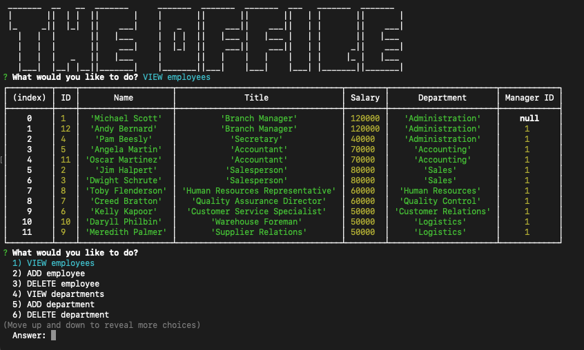

# The Office
[](https://opensource.org/licenses/MIT)
---
## Table of Contents
* [Project Summary](#project-summary)
* [Code Snippets](#code-snippets)
* [Technologies Used](#technologies-used)
* [How to Access](#how-to-access)
* [About Me](#about-me)
* [Screenshots](#screenshots)
---

## Project Summary
This is an office management program that allows you to view, add, and delete employees, roles, and departments.

## Installation
* Clone the repository.
```
git clone git@github.com:profjjk/the-office.git
```
* Install dependencies
```
npm i mysql inquirer
```
* Run file
```
node readOfficeDB.js
```

## Code Snippets
Part of an inquirer prompt where I use a function to populate the the 'choices' array.
```
choices: function() {
          const roles = [];
          for (let i = 0; i < results.length; i++) {
            roles.push({ name: results[i].title, value: results[i].role_id });
          }
          return roles;
        }
```
Creating a new instance of a class to simplify the creation of an employee.
```
.then(function(answers) {
      const employee = new Employee(answers.firstName, answers.lastName, answers.role, answers.manager);
      employee.add();
      mainMenu()
```
Complex MySql queries that display and nicely format the correct information.
```
SELECT employees.id AS ID, CONCAT (first_name, ' ', last_name) AS Name, title AS Title, salary AS Salary, department_name AS Department, employees.manager_id AS 'Manager ID'
  FROM employees
  JOIN roles 
    ON employees.role_id = roles.id 
  JOIN departments
    ON roles.department_id = departments.id
```

## Technologies Used
* [JavaScript](https://developer.mozilla.org/en-US/docs/Web/JavaScript)
* [Node.js](https://nodejs.org/en/)
* [Inquirer.js](https://www.npmjs.com/package/inquirer)
* [MySQL](https://www.mysql.com/)

## How to Access
[Note Taker - GitHub Page](https://github.com/profjjk/note-taker)

## About Me
* [LinkedIn](https://www.linkedin.com/in/the-real-jordan-kelly/)
* [GitHub](https://github.com/profjjk)

## Screenshots
